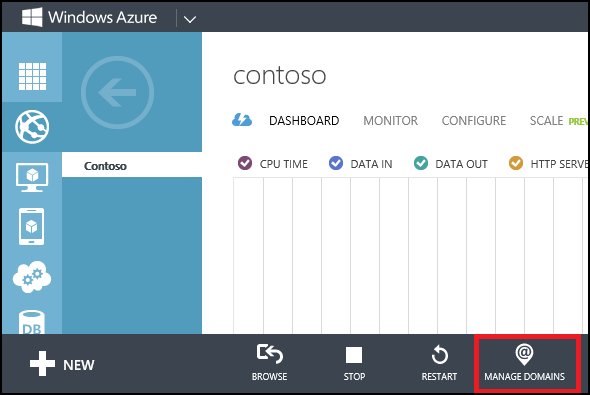
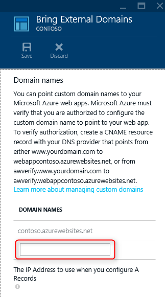

<!-- need to rollback -->

After the records for your domain name have propagated, you should be able to use your browser to verify that your custom domain name can be used to access your web app in Azure.

> [AZURE.NOTE] It can take some time for your CNAME to propagate through the DNS system. You can use a service such as <a href="http://www.digwebinterface.com/">http://www.digwebinterface.com/</a> to verify that the CNAME is available.

If you have not already added your web app as a Traffic Manager endpoint, you must do this before name resolution will work, as the custom domain name routes to Traffic Manager. Traffic Manager then routes to your web app. Use the information in [Add or Delete Endpoints](/documentation/articles/traffic-manager-endpoints/) to add your web app as an endpoint in your Traffic Manager profile.

> [AZURE.NOTE] If your web app is not listed when adding an endpoint, verify that it is configured for **Standard** App Service plan mode. You must use **Standard** mode for your web app in order to work with Traffic Manager.

1. In your browser, open the [Azure Portal](https://portal.azure.cn).

2. In the **Web Apps** tab, click the name of your web app, select **Settings**, and then select **Custom domains and SSL**

	

3. In the **Custom domains and SSL** blade, click **Bring external domains**.

	

4. Use the **DOMAIN NAMES** text boxes to enter the Traffic Manager domain name (contoso.trafficmanager.cn) to associate with this web app.

	

5. Click **Save** to save the domain name configuration.

	Once configuration has completed, the custom domain name will be listed in the **domain names** section of your web app.

At this point, you should be able to enter the Traffic Manager domain name (contoso.trafficmanager.cn) name in your browser and see that it successfully takes you to your web app.
