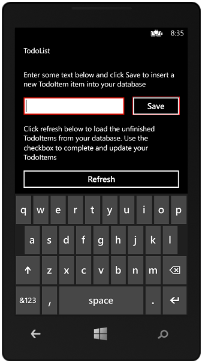

This tutorial is built on the [GetStartedWithMobileServices app](https://code.msdn.microsoft.com:443/Get-Started-with-Data-in-0e863e57), which is a universal Windows app project in Visual Studio 2013. The UI for this app is identical to the app generated by the Mobile Services quickstart, except that added items are stored locally in memory. 

1. Download the C# version of the GetStartedWithMobileServices sample app from the [Developer Code Samples site]. 

2. In Visual Studio 2013, open the downloaded project and examine the MainPage.xaml.cs file found in the GetStartedWithData.Shared project folder.

   	Notice that added **TodoItem** objects are stored in an in-memory **ObservableCollection&lt;TodoItem&gt;**.

3. Press the **F5** key to rebuild the project and start the app.

4. In the app, type some text in **Insert a TodoItem**, then click **Save**.

   	 

   	Notice that the saved text is displayed.

5. Right-click the Windows Phone 8.1 project, click **Set as Start-up Project**, then press **F5** to start the Windows Phone Store app.  

	

6. Repeat steps 3 and 4 to verify that the sample behaves the same way.