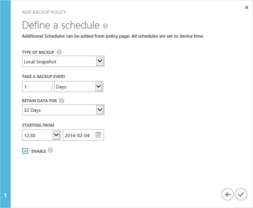

<properties 
   pageTitle="Take a backup"
   description="Describes how to define a StorSimple backup policy."
   services="storsimple"
   documentationCenter="NA"
   authors="SharS"
   manager="adinah"
   editor="tysonn" />
<tags
	ms.service="storsimple"
	ms.date="04/01/2015"
	wacn.date=""/>

### To take a backup

1. On the device **Quick Start** page, click **Add a backup policy**. This will start the Add Backup Policy wizard. 

2. On the **Define your backup policy** page:
  1. Supply a name that contains between 3 and 150 characters for your backup policy.
  2. Select the volumes to be backed up. If you select more than one volume, these volumes will be grouped together to create a crash-consistent backup.
  3. Click the arrow icon . 
  
    

3. On the **Define a schedule** page:
  1. Select the type of backup from the drop-down list. For faster restores, select **Local Snapshot**. For data resiliency, select **Cloud Snapshot**.
  2. Specify the backup frequency in minutes, hours, days, or weeks.
  3. Select a retention time. The retention choices depend on the backup frequency. For example, for a daily policy, the retention can be specified in weeks, whereas retention for a monthly policy is in months.
  4. Select the starting time and date for the backup policy.
  5. Select the **Enable** check box to enable the backup policy. 
  6. Click the check icon  to save the policy.

    
 
     You now have a backup policy that will create scheduled backups of your volume data.

You have completed the device configuration. 

